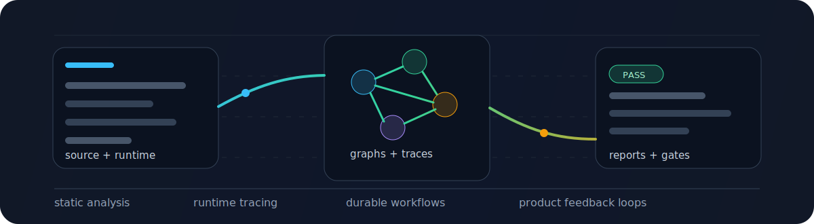

# Anas

I build developer and security systems that make hidden software behavior observable.

Static analysis. Runtime tracing. Durable backends. Real-time UX. AI-assisted developer workflows.

  
  
  
  

---

## Work I keep coming back to

<table>
  <tr>
    <td align="center" width="25%">
       
      <a href="https://github.com/anasm266/any-map">any-map</a> |
      <a href="https://github.com/anasm266/apibump">apibump</a>
    </td>
    <td align="center" width="25%">
       
      <a href="https://github.com/anasm266/installsentry">installsentry</a> |
      <a href="https://github.com/anasm266/sentinelflow">sentinelflow</a>
    </td>
    <td align="center" width="25%">
       
      <a href="https://github.com/anasm266/appledger">appledger</a> |
      <a href="https://github.com/anasm266/glint">glint</a>
    </td>
    <td align="center" width="25%">
       
      <a href="https://github.com/anasm266/typing-race">typing-race</a>
    </td>
  </tr>
</table>

---

## Stack

<table>
  <tr>
    <td align="center" width="33%">
      <strong>Product surfaces</strong>  
      
      
      
      
      
    </td>
    <td align="center" width="33%">
      <strong>Backends and platforms</strong>  
      
      
      
      
      
    </td>
    <td align="center" width="33%">
      <strong>Systems and verification</strong>  
      
      
      
      
      
    </td>
  </tr>
</table>

---

## Selected systems

<table>
  <tr>
    <td width="50%" valign="top">
      <h3><a href="https://github.com/anasm266/typing-race">typing-race</a></h3>
      
Share-link multiplayer typing races with server-owned room state, synchronized countdowns, live cursor/WPM updates, spectator mode, rematches, reconnect handling, and public analytics.

      
<strong>Why it matters:</strong> it is a small product that exercises real-time systems work instead of stopping at a local typing timer.

      

        
        
        
        
      

      
<a href="https://typing-race.pages.dev">Live app</a> | <a href="https://typing-race.pages.dev/analytics">Analytics</a> | <a href="https://typing-race.betteruptime.com">Status</a>

    </td>
    <td width="50%" valign="top">
      <h3><a href="https://github.com/anasm266/any-map">any-map</a></h3>
      
Static flow analysis for TypeScript <code>any</code>. It builds a type-flow graph, traces where <code>any</code> originates, ranks blast radius, supports branch diffs, emits JSON/DOT/SARIF, and can run as a PR gate.

      
<strong>Why it matters:</strong> it moves type cleanup from raw counts to fix-order evidence.

      

        
        
        
        
      

      
<a href="https://www.npmjs.com/package/any-map">npm</a> | <a href="https://github.com/anasm266/any-map/releases/tag/v2.0.0">v2.0.0</a> | <a href="https://github.com/anasm266/any-map/blob/main/PLAN.md">Design notes</a>

    </td>
  </tr>
  <tr>
    <td width="50%" valign="top">
      <h3><a href="https://github.com/anasm266/installsentry">InstallSentry</a></h3>
      
Replays JavaScript package installs in a temporary sandbox and records lifecycle scripts, filesystem access, network calls, fake secret canary exposure, attribution confidence, dependency graph paths, HTML reports, JSON, and SARIF.

      
<strong>Why it matters:</strong> it asks what a lockfile actually did during install, not just whether a CVE database knows about it.

      

        
        
        
        
      

      
<a href="https://github.com/anasm266/installsentry">Repo</a> | <a href="https://github.com/anasm266/installsentry/blob/master/docs/THREAT-MODEL.md">Threat model</a> | <a href="https://github.com/anasm266/installsentry/blob/master/docs/COMPARISON.md">Comparison</a>

    </td>
    <td width="50%" valign="top">
      <h3><a href="https://github.com/anasm266/sentinelflow">SentinelFlow</a></h3>
      
Dependency-risk control plane for GitHub repositories: OAuth, GitHub App installation flow, webhook verification, PostgreSQL-backed jobs, policy evaluation, audit logs, GitHub checks, dashboard views, and signed outbound webhooks.

      
<strong>Why it matters:</strong> it turns dependency scanning into a backend workflow with persistence, review, replay, and auditability.

      

        
        
        
        
      

      
<a href="https://github.com/anasm266/sentinelflow">Repo</a> | <a href="https://sentinelflow-api.onrender.com">Demo</a> | <a href="https://sentinelflow-api.onrender.com/docs">API docs</a>

    </td>
  </tr>
  <tr>
    <td width="50%" valign="top">
      <h3><a href="https://github.com/anasm266/glint">glint</a></h3>
      
Windows tray overlay for live AI coding sessions across Codex Desktop, Cursor, and Claude Code. It normalizes hook events into session state, activity feeds, done summaries, file diffs, and quick focus actions.

      
<strong>Why it matters:</strong> it treats agent work as something observable, interruptible, and reviewable from the desktop.

      

        
        
        
        
      

      
<a href="https://github.com/anasm266/glint">Repo</a> | <a href="https://github.com/anasm266/glint/blob/main/HOVER_PANEL.md">Hover panel behavior</a>

    </td>
    <td width="50%" valign="top">
      <h3><a href="https://github.com/anasm266/appledger">AppLedger</a></h3>
      
Windows app activity recorder that turns a session into a report: files touched, child processes, command lines, network endpoints, sensitive path access, startup persistence, attribution confidence, and cleanup scripts.

      
<strong>Why it matters:</strong> ProcMon shows events; AppLedger explains a session.

      

        
        
        
        
      

      
<a href="https://github.com/anasm266/appledger">Repo</a>

    </td>
  </tr>
</table>

---

## Visual snapshots

<table>
  <tr>
    <td width="33%" valign="top" align="center">
      
       
      <strong>typing-race</strong> 
      share-link real-time race flow
    </td>
    <td width="33%" valign="top" align="center">
      
       
      <strong>InstallSentry</strong> 
      install-time behavior report
    </td>
    <td width="33%" valign="top" align="center">
      
       
      <strong>ApiBump</strong> 
      semantic API diff PR comment
    </td>
  </tr>
</table>

---

## Smaller tools and validation work

- [`apibump`](https://github.com/anasm266/apibump) - Rust CLI and GitHub Action for semantic public API breakage checks in Python packages. Dogfooded against forks of `itsdangerous`, `PyJWT`, `referencing`, and `tomlkit`, with sticky PR comments and SemVer recommendations.
- [`typescript-eslint` contribution](https://github.com/typescript-eslint/typescript-eslint/pull/12278) - fixed a false positive in `no-unnecessary-type-assertion`.
- [`refined-github` contribution](https://github.com/refined-github/refined-github/pull/9280) - restored `esc-to-cancel` behavior on pull request pages.

---

## Current focus

- Developer tools that explain source, spread, and fix priority.
- Supply-chain security workflows with runtime evidence and durable audit trails.
- Desktop observability for AI coding sessions and local app behavior.
- Applied AI systems with grounded retrieval, strict schemas, evals, and clear failure handling.
- Robotics foundations through simulation, perception, and control.
